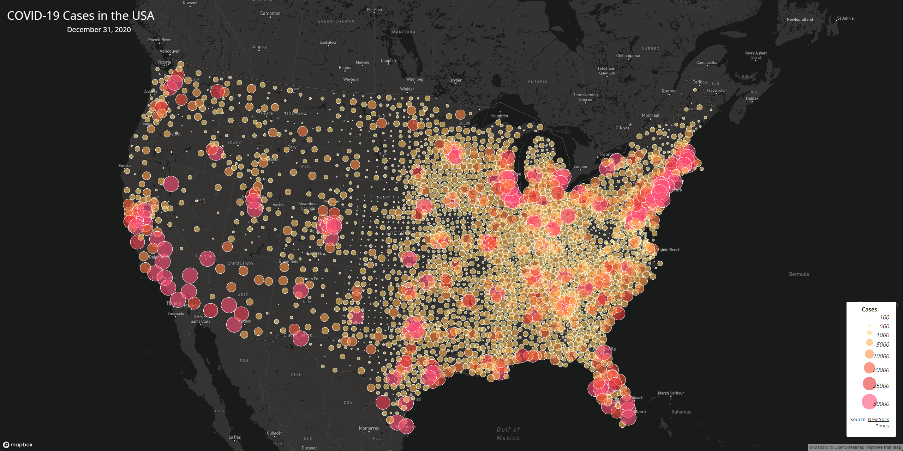
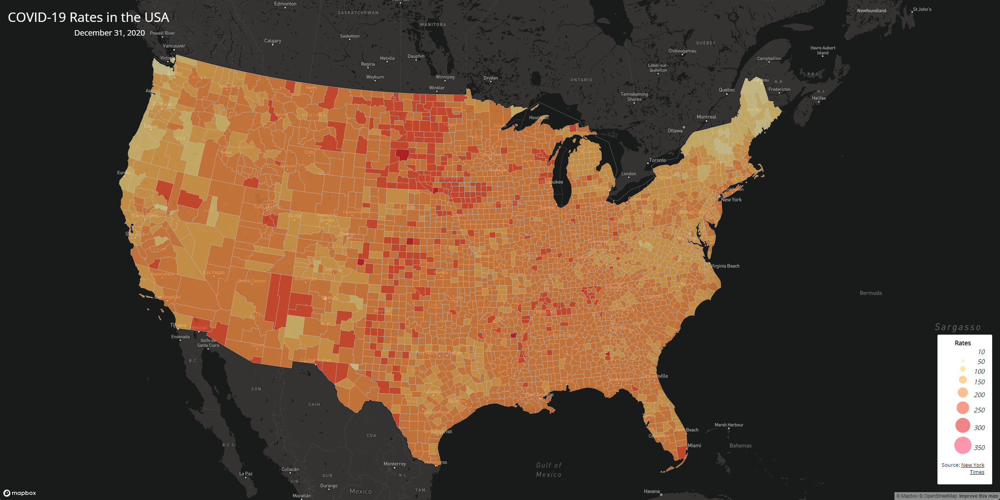

# COVID-19 Cases and Rates per County in the USA

This project is meant to show a visual representation of the COVID-19 cases and rates for each county in the USA. 

## Map Links
- [COVID-19 Rates Choropleth Map](map1.html)

- [COVID-19 Counts Proportional Symbols Map](map2.html)

## Map Screenshots

## Primary Functions

## Libraries Used

## Data Sources

## Credits